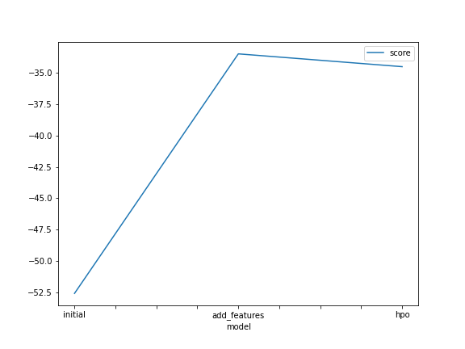

# Report: Predict Bike Sharing Demand with AutoGluon Solution
#### Abdelrahman Refaie

## Initial Training
### What did you realize when you tried to submit your predictions? What changes were needed to the output of the predictor to submit your results?
The preidctor output included negative values, which are not allowed in the submission. So, I had to replace all negative values with zeros.

### What was the top ranked model that performed?
 WeightedEnsemble_L3

## Exploratory data analysis and feature creation
### What did the exploratory analysis find and how did you add additional features?
The exploratory analysis found that the demand is higher in the morning and evening, and lower in the afternoon. So, I added a new feature called "hour" which the hour of the day.

### How much better did your model preform after adding additional features and why do you think that is?
The model score on kaggle improved from 1.835 to 0.642. I think this is because the new feature "hour" is correlated with the target "count".

## Hyper parameter tuning
### How much better did your model preform after trying different hyper parameters?
The model score on kaggle improved from 0.642 to 0.559.

### If you were given more time with this dataset, where do you think you would spend more time?
I would spend more time on both adding extra feature or doing PCA and tuning hyperparameters.

### Create a table with the models you ran, the hyperparameters modified, and the kaggle score.

    model	        hpo1	        hpo2	                    hpo3	            score
0	initial	        default	        default	                    default	            1.83566
1	add_features	default	        default	                    default	            0.64258
2	hpo	        criterion: mse	    criterion: friedman_mse	    criterion: mae     	0.55953

### Create a line plot showing the top model score for the three (or more) training runs during the project.

TODO: Replace the image below with your own.

### Create a line plot showing the top kaggle score for the three (or more) prediction submissions during the project.

TODO: Replace the image below with your own.

## Summary
I learned how to use AutoGluon to train a model and submit predictions to Kaggle for ranking. I also learned how to use Pandas to do some exploratory analysis and create a new feature, saving new versions of the train and test dataset. Finally, I learned how to tune hyperparameters from AutoGluon and resubmit predictions to rank higher on Kaggle.

